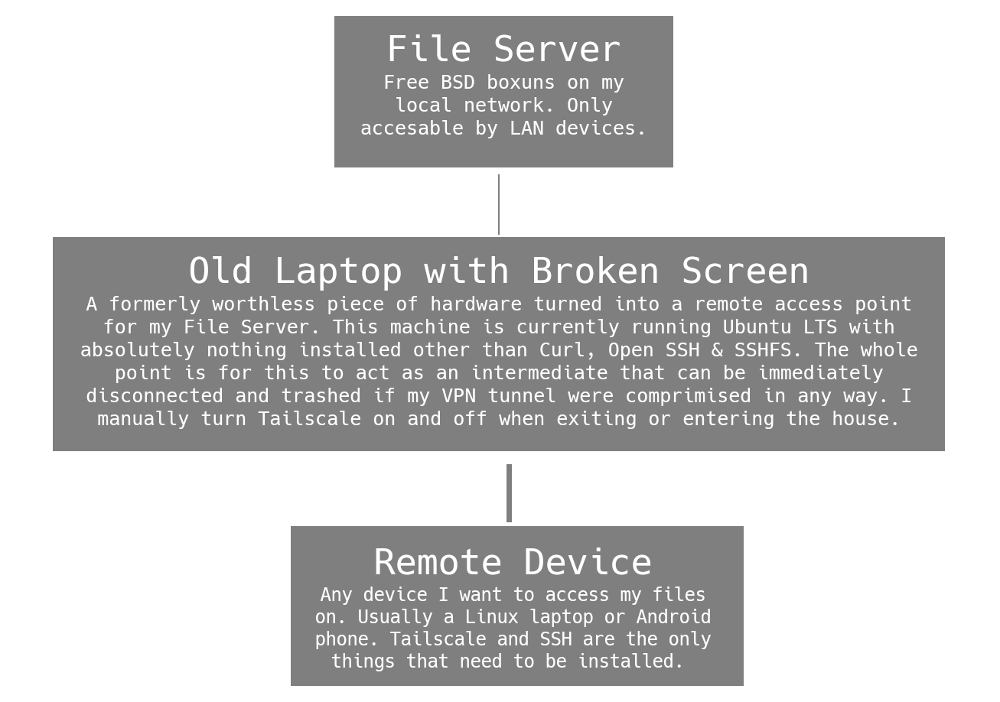

Set up a free and simple VPN tunnel to access and modify a remote file server in the most secure way possible, wile still being pretty lazy. 

## Background
The goal is to be able to access and add files to what was originally set up as a local file server, from outside of the LAN. In order to add an additional layer of security, this documentation assumes the use of an intermediate system. That is, a third system to remotely connect to, on the same LAN as the file server, that can then be used to access and manipulate the file server, without having to leave an open VPN connection on the file server itself.



## Required Software
* [Tailscale](https://tailscale.com/): A very simple VPN service, with great apps for MacOS, Windows, Linux,
BSD, Android and iOS.
* OpenSSH: For remote access.
* Scp, rSync or both: To remotely move files and directories.
* Curl: Required for installing Tailscale on Linux.

### Optional Software
* [Terminus](https://termius.com/): An iOS & Android solution that allows users to save ssh information for easy remote connection.
* Tmux: A terminal multiplexer.
* Transmission: For downloading Linux ISO ;).

## Install Instructions
### Dependencies (SSH, SCP, rSync & Curl)
#### Ubuntu
```bash
sudo apt install openssh-server curl rsync &&
sudo systemctl enable --now sshd
```

#### Arch
```bash
sudo pacman -S openssh scp curl rsync && 
sudo systemctl enable --now sshd
```

#### Fedora
```bash
sudo dnf install openssh-server scp curl rsync &&
sudo systemctl enable --now sshd
```

#### FreeBSD
```bash
sudo pkg install openssh scp curl rysync ; 
sudo kidload fuse && 
sudo sysrc sshd_enable="YES" &&
sudo service sshd start
```

#### MacOS (Via Homebrew)
```bash
brew install openssh scp curl rsync &&
brew install --cask macfuse
```

### Tailscale
#### Linux
```bash
curl -fsSL https://tailscale.com/install.sh | sh
```

#### Android or iOS 
Install the Tailscale app from the [Google Play Store](https://play.google.com/store/apps/details?id=com.tailscale.ipn) or [iOS App Store](https://apps.apple.com/us/app/tailscale/id1470499037) and login to a Tailscale account, accept any necessary permissions.

#### MacOS 
```bash
brew install tailscale
```

## Starting Tailscale
### Desktop (Linux, MacOS, Powershell)
```bash
sudo tailscale up
```

After starting the Tailscale process, an authentication link will be printed to the terminal. Follow the URL, sign in to a Tailscale account.

To stop an active VPN tunnel, run: 

```bash
sudo Tailscale down
```

#### A Note on Unattended Use
By default a Tailscale connection will stay open until a user closes the process andior the machine is restarted. Particularly when run with *sudo* on Linux, the VPN tunnel will stay *up* regardless of which user is logged in, even if no user is logged in. For the same functionality on a Windows machine, it may be necessary to run Tailscale with an additional flag for the same behavior to take place: 

```bash
tailscale up --unattended=true
```

The best resource for use case specific information is Tailscale's documentation, particularly the [page on unattended use](https://tailscale.com/kb/1088/run-unattended).

#### Android or iOS
Tailscale is toggled on an off via the respective phone application. Much the same as on desktop, once the VPN tunnel is open, by default it will remain open indefinitely. However in this case, if the Tailscale application is not kept open in the background, the connection will be closed. 

## Access
In order to connect to a device remotely all that is required is an open Tailscale tunnel on each device.

### SSH Access
Visiting [https://login.tailscale.com](https://login.tailscale.com/) on any device that you are logged in on, will provide a rundown of all machines authenticated with a given Tailscale account. Here you can easily find IP addresses for remote connection, and copy them to the clipboard. Additionally you can access the IP addresses by opening any Tailscale app, and if running on MacOS, FreBSD or Linux, by running: 

```bash
sudo tailscale status
```

Once you have the IP address, the SSH syntax is the same as it would be if you were remotely accessing a device on LAN. By default Tailscale uses port 22 for SSH. It is important to know the username for the device you are accessing via Tailscale's service. However, per standard SSH operation the username part of the equation is irrelevant if you use the same username across machines. 

```bash
ssh USER@100.XXX.XX.XX # If username is different between the two machines
ssh 100.XXX.XX.XX # If username is the same
```

#### A Note on SysAdmining
If using this remote access method to manipulate files often, it would be worth looking into *Tmux*, a multiplexer that will allow users to easily run multiple terminal sessions via one remote connection. A YouTube video with instructions specific to Tmux can be found [here](https://youtu.be/9WpU6vuus2g)).

## Moving Files
Both *Scp* and *rSync* work to move files from a remote access machine, to a file server. rSync is typically considered more robust, and will work faster for large file transfers. Tailscale also has a file sharing protocol of their own in the Alpha stage of development called, [Taildrop](https://tailscale.com/kb/1106/taildrop).

### Scp
```bash
scp /path/to/local/file USER@REMOTE:/path/to/remote/directory/ # Basic Syntax
```


Moving a single file is great for a simple test, but most use cases require moving an entire directory structure. This can be accomplished by adding the **-r** flag, for recursive transfer, to the beginning of the *Scp* command: 

```bash
scp -r /path/to/local/directory USER@REMOTE:/path/to/remote/directory/ # Basic Syntax
```

### rSync
rSync, for most use cases, is a far better option for remote file transfers. The syntax however is nearly identical to using Scp. The only change is that rSync requires the use of a **-a** flag, for *archive* transfer, in order to transfer a directory & it's contents.
 
```bash
rsync -a /path/to/local/directory USER@REMOTE:/path/to/remote/directory/
```

However, where rSync becomes a much more powerful tool, is in the additional functionality it provides. A few of the most helpful options are: 
* **-a**: To move a directory & it's contents
* **-v**: Verbose (to have the command tell you what it's doing)
* **-z**: To apply compression to a transfer
* **--progress**: To show a progress bar for longer transfers.
* **--partial**: To continue a file transfer that failed.

If a transfer does fail, it can restarted by running rSync with the same parameters and the **--partial** flag.

```bash
rsync -av /path/to/local/directory USER@REMOTE:/path/to/remote/directory/

# Transfer fails :(

rsync -av --partial /path/to/local/directory USER@REMOTE:/path/to/remote/directory/
```

#### Important Note
Using both Scp and Rsync, pay very close attention to the placement of forward slashes. In a case like this where the goal is to move the entire directory structure of *path/to/local/directory* no slash should be included:

*/path/to/local/directory* **not** ~~*/path/to/local/directory/*~~.

However, in order to ensure the directory structure ends up in */path/to/remote/directory/*, this location should include a trailing forward slash:

*/path/to/remote/directory/* **not** ~~*/path/to/remote/directory*~~.

## Getting Setup to Download Linux ISOs ;)
As a bonus round this documentation will walk through set-up and use of a command line instance of [Transmission](https://transmissionbt.com/), as downloading new Linux ISOs via the BitTorrent protocol and storing them on a file server seems to a pretty common use for these servers.

### Installation
```bash
sudo apt install transmission-cli # Ubuntu
sudo dnf install transmission-cli # Fedora 
sudo pacman -S transmission-cli # Arch
brew install transmission-cli # MacOS (vai Homebrew)
```

After installation, start the Transmission Daemon.

```bash
sudo systemctl enable --now transmission-daemon
```

### Usage
**Important Note**: This documentation will not provide full usage instructions for Transmission, just enough to get started. More complete documentation can be found on the [Arch wiki](https://man.archlinux.org/man/extra/transmission-cli/transmission-remote.1.en).

It's helpful to change the default download directory before downloading any torrents:

```bash
transmission-remote -w ~/Downloads
```

Transmission can now download torrent via a .torrent file or a magnet link using the **transmission-cli** command:

```bash
# With a .torrent file
transmission-cli /path/to/file

# With a magnet link
transmission-cli "MAGNET LINK"
```

Press **Ctrl+C** when a download is complete. 
