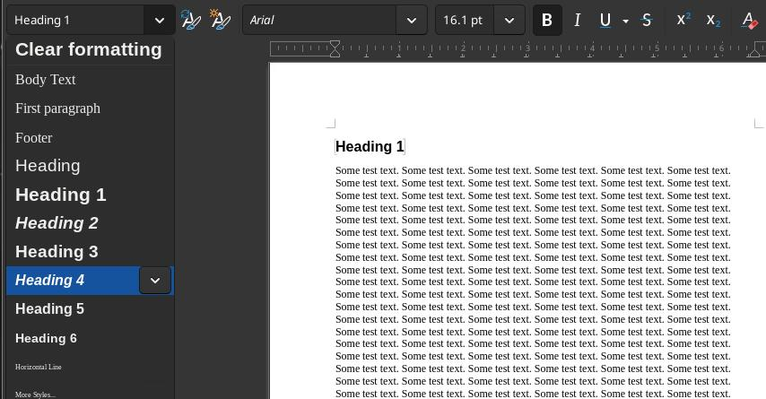
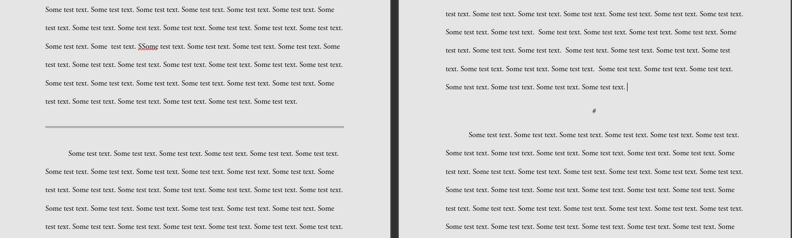

A guide for exporting Markdown *(.md)* files to Open Office *(.odt)* files, with [standard manuscript formatting](https://en.wikipedia.org/w/index.php?title=Standard_manuscript_format).

# Background
Last year I began writing my first novel. My preferred method of writing is to use the [Markdown format](https://daringfireball.net/projects/markdown/), and [Neovim](https://neovim.io/). This setup is great for writing efficiently and accessing my work on any device. However, I have run into two issues: 

1. I prefer to edit with pen & paper. Markdown is not a printer friendly format.
2. If I ever do try to publish my work, no publisher in the world will accept a *.md* file as a manuscript.

Both of these problems can be solved by periodically converting the Markdown files into an Office format. I prefer the Open Office format *(.odt)*, but this process is nearly identical with Microsoft Word *(.docx)* or Google Doc *(.gdoc)* formats.

# Required Software
* [Pandoc](https://pandoc.org/): A tool that will convert Markdown files to Open Office files. 
* [Libre Office](https://www.libreoffice.org/): My office software of choice. [Open Office](https://www.openoffice.org/) will work just as well.

### Optional
* My [Open Office Template](https://makc.co/downloads/reference.zip)
* My [*.lua* filter](https://github.com/makccr/dot/blob/master/.scripts/rule-to-scene-break.lua), available as part of my [dotfiles](https://github.com/makccr/dot).

## Installation
```bash
# Arch
sudo pacman -Syu; sudo pacman -S libreoffice-still pandoc

# Fedora
sudo dnf upgrade --refresh -y && sudo dnf install -y libreoffice pandoc

# Ubuntu 
sudo apt update && sudo apt upgrade -y && sudo apt install -y libreoffice pandoc

# FreeBSD
su && pkg update && pkg upgrade -y && pkg install -y libreoffice pandoc

# MacOS (via Homebrew)
brew update && brew upgrade && brew install pandoc libreoffice
```

# Procedure
## Open Office Template
The first step is to create an Open Office template, or, what Pandoc will refer to as a: *reference-doc*. To do this, run an existing Markdown project through Pandoc to generate an Open Office file with all of the Markdown elements.

```bash
pandoc INPUT.md -o OUTPUT.odt 
```

Open the exported *.odt* file in Libre Office and edit each paragraph style that is utilized. This can be done by opening the paragraph style menu, and using the drop down menu to edit each style individually. I have made the template I use [available for download](https://makc.co/downloads/reference.zip). 

Store this *reference.odt* file in an easy to access location, I put a copy of the template in the root directory of any writing project I'm embark on.



## .lua Filter
A problem I encountered early on involved my use of Markdown’s horizontal rule feature. When exporting to an Office format, Pandoc, quite reasonably, renders the horizontal rule as a visible line. However, in my document this element is intended to mark a scene break, which follows specific formatting conventions in a manuscript.



To avoid making changes to my Markdown documents, I created a *.lua* filter that can be run with Pandoc, and will convert the horizonal rule *(---)* in Markdown, to a *#* symbol, when exporting. In order for this filter to work properly, it is necessary to create a *SceneBreak* style in the *reference.odt* template.

```lua
-- rule-to-scene-break.lua

function HorizontalRule()
    local para = pandoc.Para({pandoc.Str("#")})
    return pandoc.Div({para}, pandoc.Attr("", {}, {["custom-style"]="SceneBreak"}))
end
```

## Creating the Final Manuscript
Using the Open Office template and *.lua* filter, convert the Markdown file to an Open Office file. In order to do this, use the standard Pandoc syntax, but provide a link to the *reference.odt* template, with the *--reference-doc=* flag, and the *.lua* filter, using the *--lua-filter=* flag.

```bash
pandoc INPUT.md -o OUTPUT.odt \
--reference-doc=reference.odt \
--lua-filter=/home/makc/.scripts/rule-to-scene-break.lua
```
