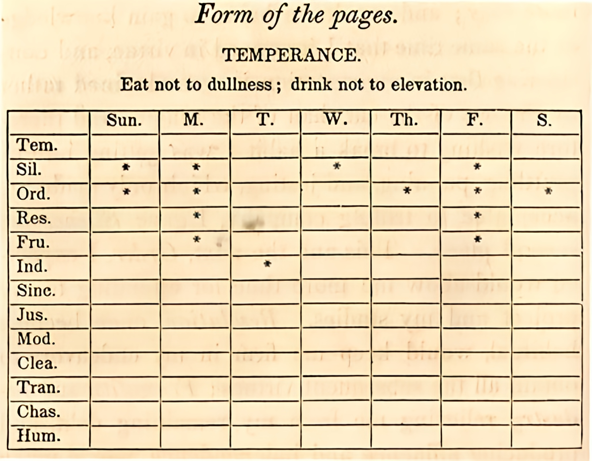
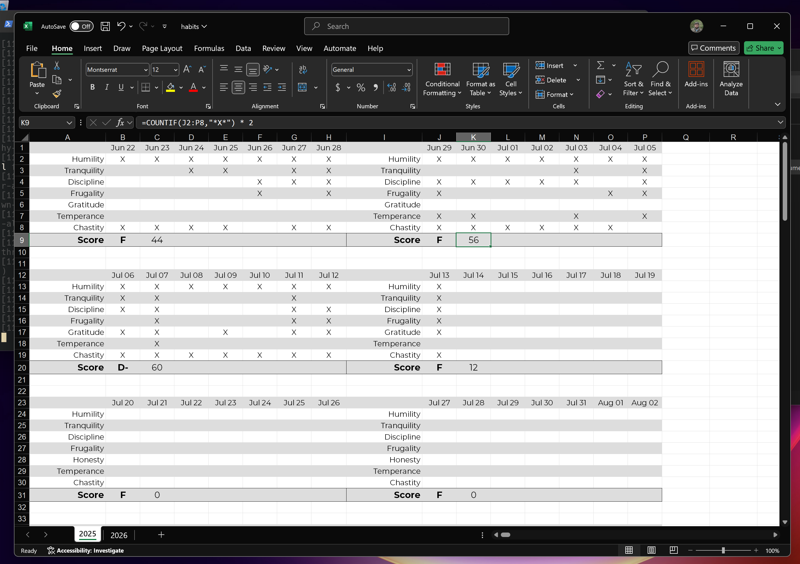

Without a doubt, the best book I’ve read this year is *The Autobiography of Benjamin Franklin*. I only opened it because it leads off The Harvard Classics—a 51‑volume anthology I describe in a [separate essay](https://makc.co/essays/2025-03-15-harvard-classics/)—but I was pleasantly surprised by how readable, engaging, and practical it is.

The most discussed section is The Art of Virtue, where Franklin lays out 13 qualities he believed make a “good human specimen”:

1. Temperance – Eat not to dullness; drink not to elevation.
2. Silence – Speak only when it benefits yourself or others. Avoid trivial talk.
3. Order – Let all things have their place; every task its time.
4. Resolution – Do what you ought; follow through without fail.
5. Frugality – Spend only to benefit yourself or others. Waste nothing.
6. Industry – Always be doing something useful. Cut out the unnecessary.
7. Sincerity – Use no deceit. Think justly, speak accordingly.
8. Justice – Do no harm, whether by action or neglect.
9. Moderation – Avoid extremes; don’t overreact to injury.
10. Cleanliness – Keep yourself, your clothes, and your home clean.
11. Tranquility – Don’t be disturbed by small things or accidents.
12. Chastity – Use sex only for health or offspring, never to excess or harm.
13. Humility – Imitate Jesus and Socrates.

Two things grabbed me right away:

* **The Comparison Between Jesus and Socrates**. Franklin isn’t the only Founder to pair them; Jefferson does the same in [*The Life and Morals of Jesus of Nazareth*](https://thejeffersonbible.com/), his cut-and-paste iterative isolation of just the story of Jesus and philosophy contained in The New Testament Gospels.
* **The idea of tracking virtues, not habits.** Franklin built a weekly chart (see below) and marked a box whenever he failed a virtue. The goal was character, not routine.



That distinction solved a problem I’ve long had with habit trackers. My lists balloon—work out, read, Duolingo, create something—until the whole system implodes. Franklin’s approach refocuses on principles I actually value. Habits follow naturally.

He also advanced one virtue at a time. Week 1: Temperance. Week 2: add Silence. And so on. Tracking all 13 gives honest data; concentrating on one prevents overload.

In practice, I’ve slimmed Franklin’s list to seven virtues that group naturally for me—e.g., I can’t picture Order, Industry, and Cleanliness separately. Your mileage may vary.



Paper worked fine, but I wanted weekly grades for quick comparison, so I built a spreadsheet. Each day I type “X” under any virtue I missed; the sheet totals my slips and converts them to a letter grade:

```

=COUNTIF(START:END,"*X*") * 2.04

=LOOKUP( GRADE-CELL,  
{0;60;63;67;70;73;77;80;83;87;90;93;97},  
{"F";"D-";"D";"D+";"C-";"C";"C+";"B-";"B";"B+";"A-";"A";"A+"} )

``` 

Franklin’s simple chart still feels modern: measure what matters, focus narrowly, improve steadily. It’s habit‑tracking with a soul.
