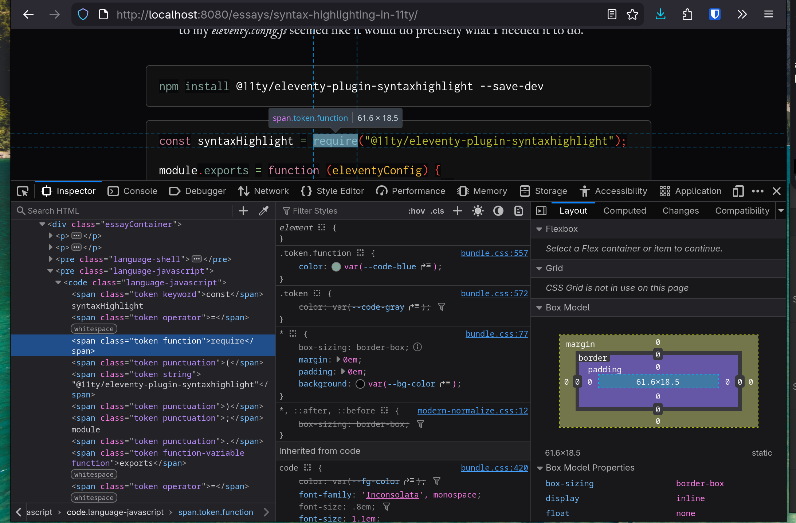

Unless you stalk my [GitHub account](https://github.com/makccr) relentlessly, you are probably unaware of it, but [my website](https://makc.co) was developed using the static site generator, [Eleventy (11ty)](https://www.11ty.dev/). 11ty offers incredibly easy web development, not only because of its capability to play nicely with a massive amount of different file formats, but also because of its massive library of NodeJS plugins. Throughout the process of developing and maintaining my website, I have found that adding a new feature to my site is often as simple as running _npm install X_ and making a small change to the _eleventy.config.js_ file in my root directory. Earlier this week, when I decided that I wanted to add syntax highlighting to HTML code blocks on my site, the process looked to be just that simple.

The most complicated part of this process is solved by 11ty itself. Typically, any page that I can get away with not writing custom HTML for, I simply write in the Markdown format. Using 11ty, however, this is no problem. Once the site is compiled, Markdown is automatically converted to HTML, and I can easily style any text that was marked as code in Markdown as a class separate from the site’s normal text. Even when attempting to take the next step and add individual syntax highlighting to these code blocks, I quickly came across a tool called [PrismJS](https://prismjs.com/) that seemed to do exactly what I needed it to. Simply running one command in the terminal and adding some text to my _eleventy.config.js_ seemed like it would _just work_, just the way I’ve become accustomed to things in the 11ty ecosystem working.

```bash
npm install @11ty/eleventy-plugin-syntaxhighlight --save-dev
```

```bash
const syntaxHighlight = require("@11ty/eleventy-plugin-syntaxhighlight");

module.exports = function (eleventyConfig) {
    eleventyConfig.addPlugin(syntaxHighlight);
    return eleventyConfig; 
};
```

However, after hooking everything up and compiling my 11ty site, I found that nothing appeared to have changed. I did a bit of research and found a great article by Martin Gunnarsson, in which he detailed his own experience [going through the same process](https://www.martingunnarsson.com/posts/eleventy-syntax-highlighting/). He ran into problems when he didn’t label code blocks through Markdown as PrismJS was expecting. If you are unfamiliar with Markdown, there are three different ways to denote code in Markdown:

```markdown
1. Inline markdown where only `a few words` are denoted as code

2. A proper code block: 
'''
console.log("some code");
'''

3. A code block with a label: 
'''javascript
console.log("some code");
'''
```

It turns out that the syntax highlighting plugin from 11ty only supports the third option: a full code block with a label at the top line declaring the language to which the syntax highlighting needs to be applied. Unfortunately for me, this is how I had already formatted damn near all of my code blocks site-wide. So I went ahead and took a closer look:



After taking a look at the inspector window in Firefox, it became clear to me that the PrismJS plugin was doing quite a bit. When rendering the HTML document for my site, 11ty no longer was simply putting all of the text in a generic _code_ block, but was instead creating individual CSS classes for _language-javascript_, _language-shell_, and so on - as well as breaking down the contents of the block even further into classes for _punctuation, string, operator, comment_ and several other elements that made up the blocks. The only problem? The text in the code block was still the same color as generic text, no styling at all. This was odd, but it also wasn’t the worst thing in the world. Knowing myself, I knew I’d eventually want a way to customize the colors and makeup of the individual elements myself anyway, so I began the process of trying to compile a concrete list of every class that the syntax highlighting plugin would create for every single one of the nearly 300 languages that PrismJS supports -- no easy task.

But, before I break down how I solved that problem, it is worth noting that 11ty’s plugin should automatically add syntax highlighting when it is installed. I have since confirmed that the only reason this was not happening on my site is that I had previously added customization to the “_code”_ and “_pre”_ CSS classes, changing the text color. After removing that customization, the syntax highlighting worked as expected. But unfortunately, I didn’t confirm that this was the case until after I had already spent nearly a full workday figuring out a way more complex workaround, which just happens to add a higher level of customization.

It only took me a matter of minutes to find a way to isolate every one of these class names that PrismJS was creating. Simply opening the Console in Firefox and typing the following showed me every class being rendered on an individual page.

```javascript
[...new Set(
  [...document.querySelectorAll('pre code span')]
    .map(el => el.className)
)]

// That returned: 
Array(9) [ "token function", "token keyword", "token operator", "token punctuation", "token string", "token function-variable function", "token parameter", "token list punctuation", "token code-snippet code keyword" ]
```

Of course, I realized now that using this method, the only way I’d ever be able to make sure that every piece of syntax was formatted properly would be to somehow have a snippet of every single one of PrismJS’s 297 supported languages in one Markdown document. So I got to work.

A few hours later, I had a single Markdown file that contained a one-line snippet of all 297 languages (or pretty close to all of them), and once I compiled the site and ran my console code again, I had a _comprehensive enough_ list of every class that PrismJS could potentially create on my site. Once I had that list, the process was as simple as creating a custom set of color variables at the top of my main CSS page, which I themed using the [Gruvbox](https://github.com/morhetz/gruvbox) color scheme:

```css
:root { /* Base Settings */
  --code-aqua: #8ec07c;
  --code-green: #b8bb26;
  --code-purple: #d3869b;
  --code-blue: #83a598;
  --code-yellow: #fabd2f;
  --code-red: #fb4934;
  --code-gray: #a89984;
} /* Defining color scheme */
```

And after setting up color definitions, I began the work of applying each color to the proper CSS classes. Luckily for me, 297 different languages only generated 34 different CSS classes that I needed to assign, but once again, this process took a few hours of experimenting to get everything right. Eventually, I managed to get everything where it was meant to be and ended up with what should be proper syntax highlighting for every single one of PrismJS’s supported languages.

```css
/* CODE COLORS */
.token.comment, .token.prolog, .token.doctype, .token.cdata {
    color: var(--code-gray);
    font-style: italic; }

.token.operator, .token.assign-left, .token.builtin, .token.entity, .token.namespace {
    color: var(--code-aqua); }

.token.string, .token.char, .token.attr-value, .token.inserted {
    color: var(--code-green); }

.token.attr-name, .token.property, .token.keyword, .token.selector {
    color: var(--code-purple); }

.token.function { color: var(--code-blue); }

.token.number, .token.boolean, .token.variable, .token.parameter, .token.class-name, .token.type {
    color: var(--code-yellow); }

.token.regex, .token.symbol, .token.punctuation, .token.constant, .token.tag {
    color: var(--code-red); }

.token.bold { font-weight: bold; }
.token.italic { font-style: italic; }
.token.deleted { color: var(--code-red); }

.token.important {
    color: var(--code-red);
    font-weight: bold;
} .token { color: var(--code-gray); }
```

It does seem worth mentioning once more that this whole process is not necessary to get syntax highlighting working with 11ty. But if anyone else out there just happens to want to use a custom color scheme that isn’t supported by Prism, or finds themselves in a position where they need to customize any of the syntax highlighting that PrismJS generated, hopefully you’ll come across this essay and not waste the six hours that I wasted figuring this all out.
