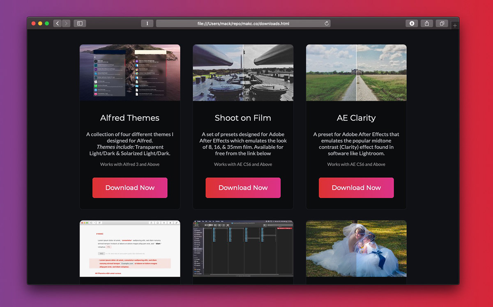
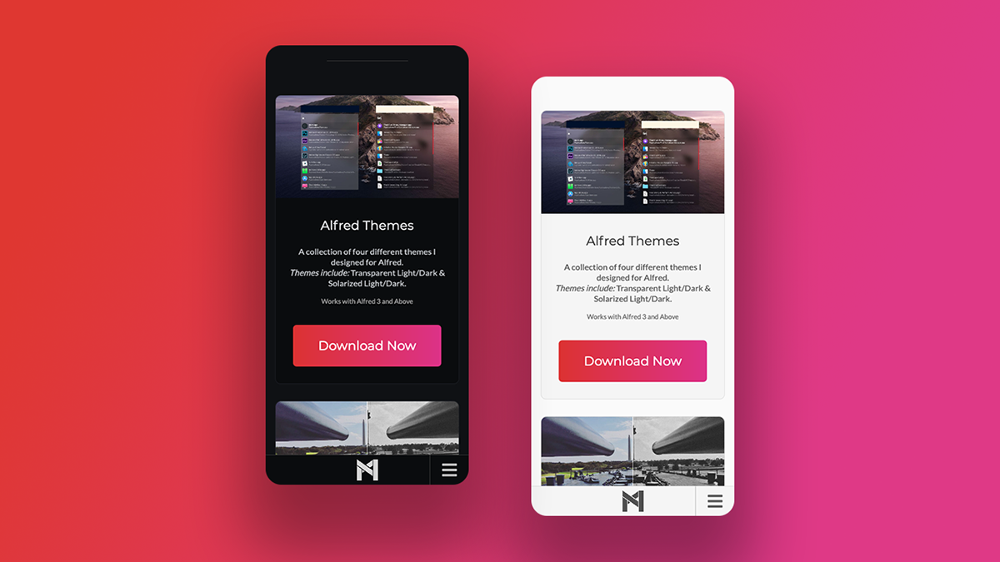
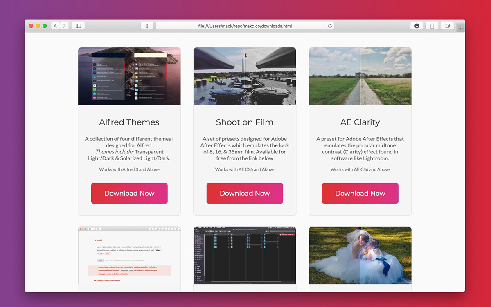

## Using CSS & HTML Only
While designing a re-release of my personal website, I ended up with the challenge of designing a responsive CSS card. The goal was to make the simplest, light-weight design possible that still looked really clean and modern.

 Along with the goal of making these cards look really great on mobile or desktop versions of my site, at any resolution; I set out to design a card that will look great with a light-mode or a dark mode on my website. The cards are using media queries to support theme switching with the system theme on MacOS and the upcoming iOS 13, and will automatically and seamlessly switch between light and dark mode without the end user ever having to push a button, or even notice what is going on.
