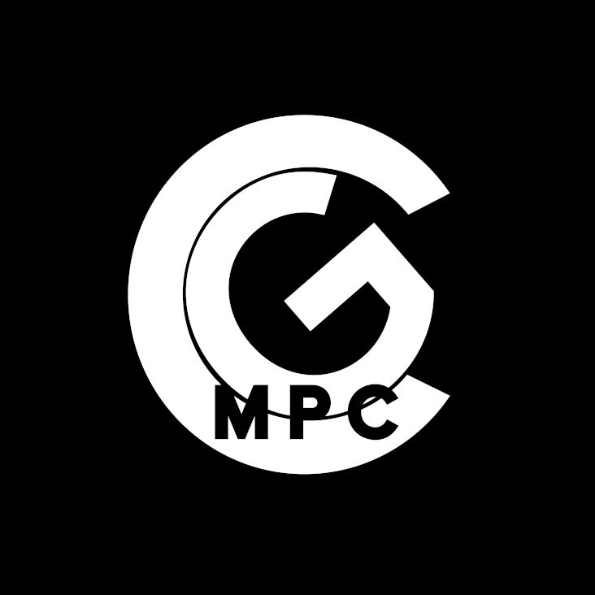
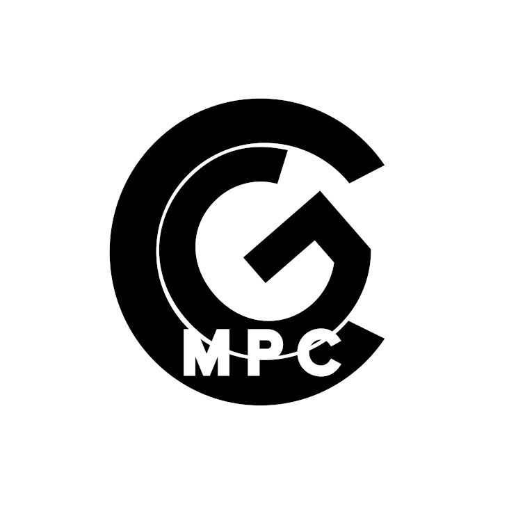

## Branding & Logo Design
This is an example of really clean and simple branding that I worked on for CineGenie MPC. The logo was designed, basically just as typography, just to that it was as easily decipherable as possible. It was never going to be a company that was going to be seen enough to be recognizable enough to just be a symbol. But once the actual logo was done, I just extruded it, adding some motion and a background; and kept the animation as simple as possible.

 
 
 
