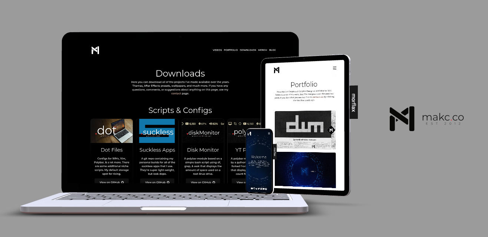

# [makc.co](https://makc.co)
This is the repository for my website. The main goal of the website, is to be a website (duh) - that is to serve as a hub that links to the various projects I've worked on that are available for access online, and a hosting platform to download some of the projects that I have made available for download. 

In addition, I like to use this website as a personal kind of a *sandbox*. For a long time this meant that the website was built exclusively the old fashioned way: no frameworks, no libraries; just straight HTML, CSS & JavaScript. If you are interested in that kind of web design, I did produce a little [series of videos](https://www.youtube.com/watch?v=avjB5rQMm24&list=PLIYVhRocqRoT6yvieIyNehUz6VnB6hXhF&pp=gAQB) on my YouTube channel that featured me stumbling through the process of creating a website out out of poorly organized texted documents and crossed fingers. 

These days the site is a lot more boring, but also a whole lot lower maintenance. The site is built on the back of [11ty](https://github.com/11ty/eleventy/) and uses [Airtable](https://airtable.com/) as a sort of a CMS solution for a few of the pages. I have toyed with the idea of making a series of videos that would cover how I managed to put this all together, but in the meantime this repository should serve as at least some kind of instruction.

*P.S.*: If you're interested in a series of video on the current iteration of my site, feel free to [e-mail](mailto:m@makc.co:) me to let that request be known; and be sure to keep and eye on my [YouTube channel](https://www.youtube.com/@makc) just in case I publish something without telling anyone...

[](https://studio.morflax.com/things/)

### Just for my use: 
```
npx @11ty/eleventy
```
```
npx @11ty/eleventy --serve
```
```
git checkout eleventy
```
```
npm install @11ty/eleventy
```
```
npm i @11ty/eleventy-img
```
```
npm install luxon --save-dev
```
```
git subtree push --prefix _site origin gh-pages
```

##### Portfolio Head
```liquid
---
layout: portfolio.html
title: TITLE
image: img/IMAGE
date: YEAR-01-01
tags:
  - TYPE
---
```

##### Essays Head
```liquid
---
title: TITLE
layout: essay.html
image: img/IMAGE
date: Y-M-D
---
```

##### YouTube Embed 
```css
<div class="youtube">
    <div class="youtube-video-container-16">
        <iframe width="560" height="315"
            src="LINK"
            frameborder="0"
            allow="accelerometer; encrypted-media; gyroscope; picture
-in-picture"
            allowfullscreen >
        </iframe>
    </div>
</div>
```
